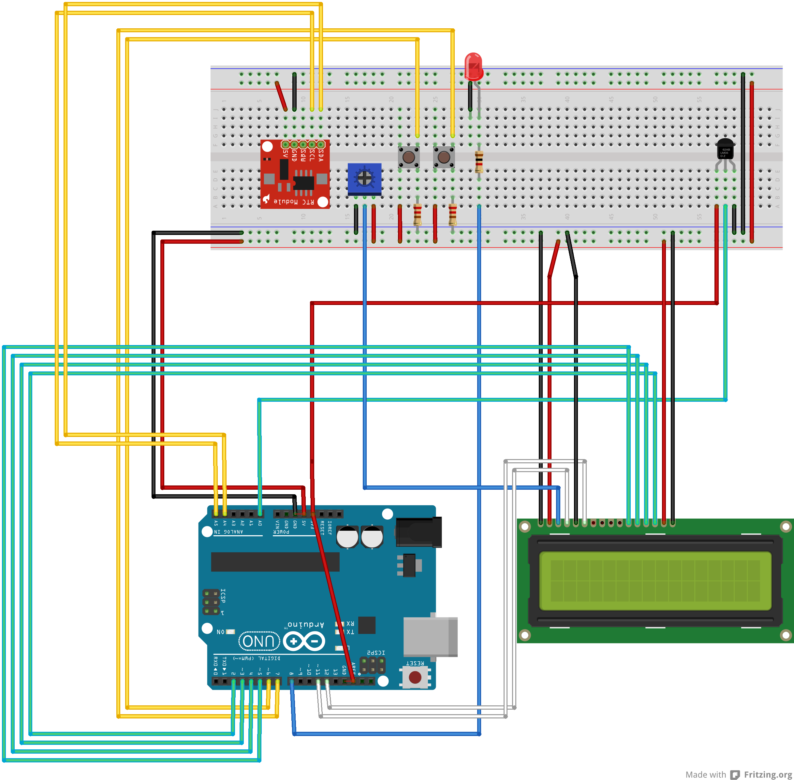

# An Arduino Thermostat

I started this project to create a thermostat which could be controlled from the internet with the following features:

- REST API
- one unit connected to the CV and a unit to control the thermostat
- both units communicating via RF
- have a program for every day of the week with up to 4 time intervals to set a temperature
- be able to temporarily change a temperature for a time interval
- holiday mode, set a specific temperature which will be held until the mode is disabled
- iOS notifications via Prowl when CV is turned on and off

The FrankenStat conists of 2 arduino's. The first is the MCP, which has the
controls, display and the logic. The 2nd Arduino is called BIT and controls
the CV burner. Both Arduino's communicate through a 433MHz RF link.

# Parts

- 2x Atmega328 based Arduino
- 2x MCP9701 Thermistor
- Hitachi HD44780 compatible LCD screen with I2C interface adapter
- DS1307 RTC
- 2x Buttons
- 433 MHz RF receiver
- 433 MHz RF transmitter
- LED
- Relay

Before compiling copy include/prowl.h-example to include/prowl.h and insert your Prowl API key (make one on the Prowl site, if you don't already have one).

# Building

I use the [Arduino makefile](https://github.com/sudar/Arduino-Makefile.git), as I hate the Arduino IDE. This should work on Linux and Mac OS X.

    git clone https://github.com/sudar/Arduino-Makefile.git
    ln -s Arduino-Makefile/arduino-mk
    git clone https://github.com/arnoudj/FrankenStat.git
    cd FrankenStat
    cp include/prowl.h-example include/prowl.h # and change the API key
    cd mcp
    vi Makefile # and change the device name for your arduino
    make upload
    cd ../bit
    vi Makefile # and change the device name for your arduino
    make upload

# Schematic

TODO: Schematic is outdated, needs an update.

# Sensor Accuracy

I noticed that the temerature would go up, when the LED was turned on by about 0.25 degrees. Measuring the voltage showed a small drop in voltage. This was solved by using the 3.3V power, and hooking the 3.3V power to the AREF pin. See the sensor guide on [Adafruit](http://learn.adafruit.com/tmp36-temperature-sensor/using-a-temp-sensor).

# API

To read the status and control the temperature the following URL's can be used:

## /

Returns the status of the thermostat.

    {
      "target": 21,
      "current": 21.15,
      "burner": false,
      "mode": 0
    }

## /up

Increase the target temperature. If the mode is set to auto, then mode will be set to temp. Returns the new target temperature and mode.

    {
      "target": 21.5,
      "current": 21.15,
      "burner": false,
      "mode": 1
    }

## /down

Decrease the target temperature. If the mode is set to auto, then mode will be set to temp. Returns the new target temperature and mode.

    {
      "target": 21.5,
      "current": 21.15,
      "burner": false,
      "mode": 1
    }

## /mode/MODE[/16]

Set the operating mode. Modes can be:

    0: Automatic
    1: Temporary
    2: Holiday

Returns the new target temperature.

    {
      "target": 16.0,
      "current": 21.15,
      "burner": false,
      "mode": 1
    }

# TODO's

## MCP

- Store the schedule in EEPROM
- API to manage schedule
- Add LDR to detect if light is on or not, no use heating when no-one is home
- Design PCB
- Make a nice enclosure
- Set time using NTP
- Code refactoring, it's ugly and unreadable  ;)

## BIT

- Add a temperature sensor to BIT and make it use this sensor to set the temperature to a save setting when no message has been received from the MCP for a specific time.
- Design PCB
- Make a nice enclosure

# Useful URL's

- [EtherCard Examples](https://github.com/thiseldo/EtherCardExamples)
- [Open Energy Monitoring](https://github.com/helxsz/Webinos---Open-energy-monitoring/blob/master/server2_4.pde): Nice example on how to use the EtherCard library.
- [McMicken Thermostat](http://mcmicken.ca/arduino/Thermostat_V1.html) Another Thermostat
